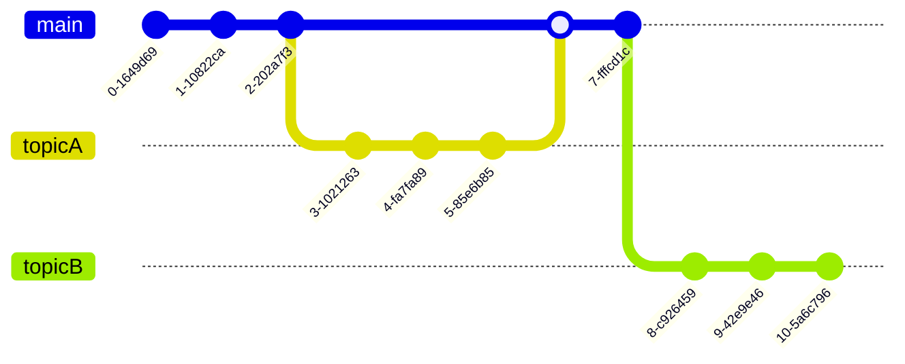

## block

### Notation "```"

You can specify a function name in the first \`\`\`.

@@@

```plaintext
block
```

@@@

```plaintext
block
```

### Default function name

If the function name is omitted, "textplain" is used.

@@@

```
block
```

@@@

```
block
```

### Alternative notation "@@@"

When you want to enclose a block with a block, you can specify "\@\@\@".

It should not be used for any other purpose.

```
@@@
block
@@@

```

@@@
block
@@@

### Functions

#### Table block

@@@

```table
|X|Y|Z|
|:|:|:|
|1|2|3|
```

@@@

```table
|X|Y|Z|
|:|:|:|
|1|2|3|
```

#### Quote block

@@@

```quote
>1
>>2
>>2
>>>3
>1
```

@@@

```quote
>1
>>2
>>2
>>>3
>1
```

#### Note Block

@@@

```note
If "note" is specified, annotations can be shown.
Other types of notes can also be specified\: info, warning, and alert.
```

@@@

```note
If "note" is specified, annotations can be shown.
Other types of notes can also be specified\: info, warning, and alert.
```

##### info

@@@

```note info
"info" clearly indicates more important information than "note".
Nevertheless, the operation of the area is left to the authors.
```

@@@

```note info
"info" clearly indicates more important information than "note".
Nevertheless, the operation of the area is left to the authors.
```

##### warning

@@@

```note warn
"warn" means warning.The same behavior is observed if “warning” is specified.
```

```note warning
You can also use //markdown// **for** ..description...
```

@@@

```note warn
"warn" means warning.A “warning” may also be specified.
```

```note warning
You can also use //markdown// **for** ..description...
```

##### alert

@@@

```note alert
"error” can be specified in the same way as "alert".
```

```note error
This means the highest level of notice.
```

@@@

```note alert
"error” can be specified in the same way as "alert".
```

```note error
This means the highest level of notice.
```

#### Katex block

@@@

```katex
|x| = \begin{cases}
x & x \ge 0 \\
-x & x \lt 0
\end{cases}
```

@@@

```katex
|x| = \begin{cases}
x & x \ge 0 \\
-x & x \lt 0
\end{cases}
```

#### PlantUml block

@@@


@@@


#### mermaid block

@@@



@@@


#### pintora block

@@@

```pintora
activityDiagram
start
:render functionl called;
if (is mimeType image/svg+xml ?) then
  :renderer svg;
  :render with jsdom;
  :generate string;
else (no)
  :renderer canvas;
  :render with node-canvas;
  :generate image buffer by mimeType;
endif

:return result;

end
```

@@@

```pintora
activityDiagram
start
:render functionl called;
if (is mimeType image/svg+xml ?) then
  :renderer svg;
  :render with jsdom;
  :generate string;
else (no)
  :renderer canvas;
  :render with node-canvas;
  :generate image buffer by mimeType;
endif

:return result;

end
```

#### YouTube block

@@@

```youtube
  id: Bjlv7c-zAvQ
```

```youtube
  id: Bjlv7c-zAvQ
  width: 480px
  height: 320px
```

@@@

```youtube
  id: Bjlv7c-zAvQ
```

```youtube
  id: Bjlv7c-zAvQ
  width: 480px
  height: 320px
```

#### Code highlighting by prism

##### Show supported code formats

```

@@formats@@

```

@@formats@@

##### Typescript sample

@@@

```typescript
var test = 1;
console.log(test);
```

@@@

```typescript
var test = 1;
console.log(test);
```
