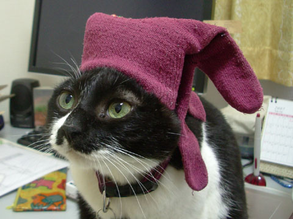

## Hyper link

### Annotation "^"

#### Source

```
Gabgab loves Desudesu.[^1]
```

Gabgab loves Desudesu.[^1]

#### Detail

```
[^1]: Because she always keep the beer cold.
```

[^1]: Because she always keep the beer cold.

### Automatic link

URLs are automatically linked.

```
https://www.google.com:80/
```

https://www.google.com:80/

### Link to Header "#"

```
[]() // no effect

[](#Text)

[forbidden]()

[Text notation](#Text)
```

[]()

[](#Text)

[forbidden]()

[Text notation](#Text)

### Link To other markdown

#### Relative path

```
[](./text)

[Text](./text)

[Text](text)
```

[](./text)

[Text](./text)

[Text](text)

#### Absolute Path

```
[](/text)

[Text](/text)
```

[](/text)

[Text](/text)

#### Out of root directory

```
[parent][../text]
```

[parent][../text]

### URL link with label

```
[Google](http://www.google.com)  // store to dictionary and show link

[Google]                         // load from dictionary and show link
```

[Google](http://www.google.com)

[Google]

### Embbed image "!"

```


![Google]




```


![Google]


### Specify the display size for an image

@@@

```image
    src     : ./img/kuroko.jpg
    width   : 160px
    height  : 120px
    align   : right
    href    : https://www.google.com
```

@@@

```image
    src     : ./img/kuroko.jpg
    width   : 160px
    height  : 120px
    align   : right
    href    : https://www.google.com
```

### Link to image

```
[](http://www.google.com)
```

[](http://www.google.com)

### Store URL for later reference

#### Store

```
[twitter]: https://www.twitter.com/
```

[twitter]: https://www.twitter.com/

#### Reference

```
[twitter]
```

[twitter]

#### Reference by alias

```
[X][twitter]
```

[X][twitter]
